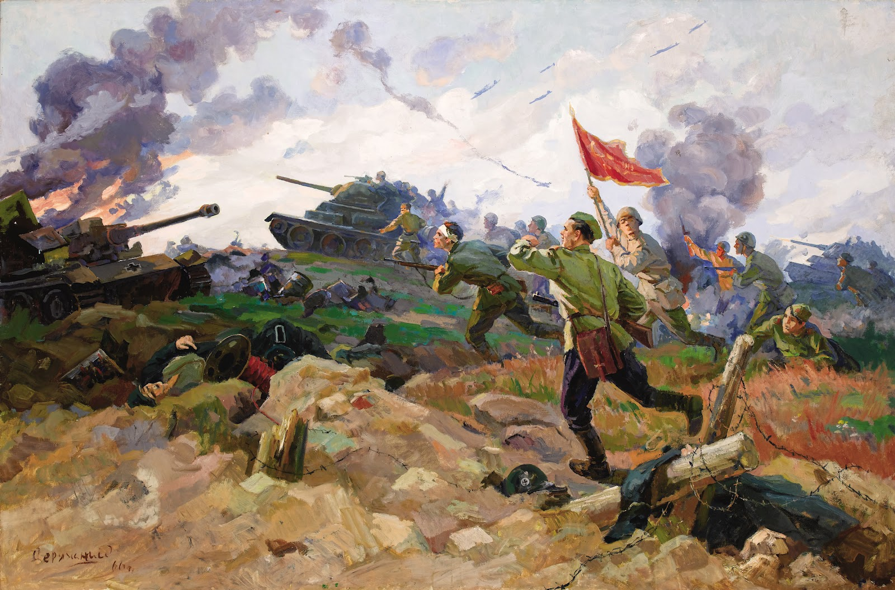

# Spring 2018
# Project 1: What did the presidents say at their inauguration?

### [Project Description](doc/)
The literary theorist Kenneth Burke, in his work Grammar of Motives, argued that the precision of one’s language reflects that individual’s philosophy;for example,a perfectionist would use words that are free of any ambiguity. Therefore, understanding the text of the inaugural speeches is important in understanding the course of action a President would take in his term. Do the inaugural speeches represent the popular thought? Do inaugural speeches give an insight into the intention of the Presidents? Are the words used during a period of War different from those used during period of Peace? Well.... yes! This project studies the speeches of presidents by categorizing them into "War Time" Presidents and "Peace Time" Presidents. We aim to study how the usage of words, sentence construction, and sentiments change over time- from period of peace to period of war.

Term: Spring 2018

+ Projec title: War and Peace
+ This project is conducted by Anshuma Chandak

+ Project summary:(doc/)
We are given 58 inaugural speeches by 45 presidents of the United States of America.Inspired by an article in Washington Post, titled-*"Here’s how much of your life the United States has been at war"*,I decided to study the speeches of American Presidents by categorizing them into "War time" Presidents and "Peace time" Presidents and see if there is a remarkable difference in the sentence construction, emotions, and topic of their speeches. 
For the purpose of this study, a war time president is the one who was involved in signing a war declaration, and actively engaged in taking the US to war. While, a peace time president is the one who either did not have any war during his term or was involved in ending an ongoing war. I took the following presidents in the "War Time Presidents" cohort:- Woodrow Wilson (World War I), Franklin D. Roosevelt (World War II), Lyndon B. Johnson (Vietnam War), and George W. Bush (Iraq War). The following are the presidents, I have included in the "Peace Time Presidents":- John Quincy Adams, Ulysses S. Grant, Dwight D. Eisenhower, and Jimmy Carter.

