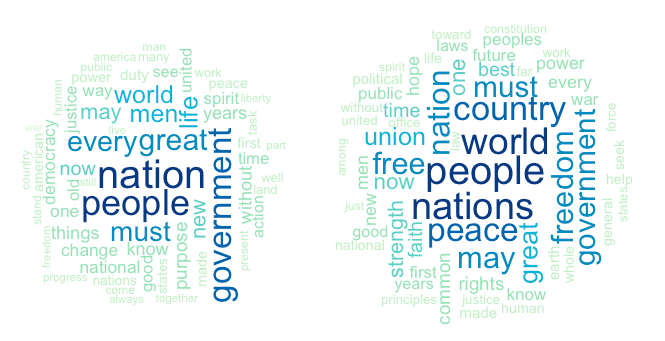
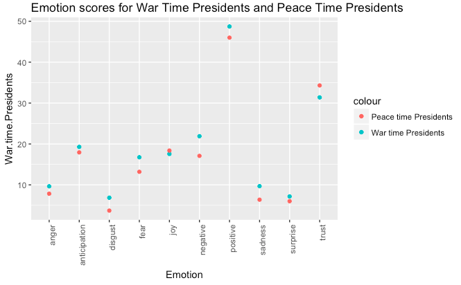

# Spring 2018
# Project 1: What did the presidents say at their inauguration?

### [Project Description](doc/)
The literary theorist Kenneth Burke, in his work Grammar of Motives, argued that the precision of one’s language reflects that individual’s philosophy;for example,a perfectionist would use words that are free of any ambiguity. Therefore, understanding the text of the inaugural speeches is important to understand the political principles that will guide the new administration. Do the inaugural speeches represent the popular thought? Do inaugural speeches give an insight into the intention of the Presidents? Are the words used during a period of War different from those used during period of Peace? Well.... yes! This project studies the speeches of presidents by categorizing them into "War Time" Presidents and "Peace Time" Presidents. We aim to study how the usage of words, sentence construction, and sentiments change over time- from period of peace to period of war.

Term: Spring 2018

+ Projec title: War and Peace
+ This project is conducted by Anshuma Chandak

+ Project summary:
Inspired by an article in Washington Post, titled-*"Here’s how much of your life the United States has been at war"*,I decided to study the speeches of American Presidents by categorizing them into "War time" Presidents and "Peace time" Presidents and see if there is a remarkable difference in the sentence construction, emotions, and topic of their speeches. 

For the purpose of this study, a war time president is the one who was involved in signing a war declaration, and actively engaged in taking the US to war. While, a peace time president is the one who either did not have any war during his term or was involved in ending an ongoing war. We took the following presidents in the "War Time Presidents" cohort:- Woodrow Wilson (World War I), Franklin D. Roosevelt (World War II), Lyndon B. Johnson (Vietnam War), and George W. Bush (Iraq War); and the following in the "Peace Time Presidents" cohort:- John Quincy Adams, Ulysses S. Grant, Dwight D. Eisenhower, and Jimmy Carter.

The following word cloud shows the difference in the usage of words by the War-time presidents and the Peace-time presidents. 

The speeches of the war-time presidents (left) have less diversity in terms of vocabulary, and we see the following words the most- people, nation, world,government. Looking at the word cloud of peace-time presidents (right), there is more diversity in the words used, with the following words having the highest frequency of showing up- peace, nation, people, freedom, free, union, government. There is more usage of words that signify solidarity, in the speeches of peace-time presidents.

Having looked at the frequency of words, we now take a look at the emotion quotient of the speeches:

We observe that the speeches of war time presidents are more emotionally charged with higher scores for anger, disgust, fear, and negative sentiment. There is 30 per cent more negative sentiment, 23 per cent more anger, and 85 per cent more disgust in war-time presidents' speech than the peace-time presidents' speech.  There is lesser trust and positive sentiment in their speeches as compared to the speeches of the peace-time presidents.

All the results point to the fact that the speeches of War-time presidents were more direct, succint, and emotionally charged. At the end of this study, I wonder if the times lead to such speeches or if the speeches lead to such times? I leave this idea open to the reader, and continue to dig deeper into the psyche of the Presidents of the United States of America. 

Final note:
* To reproduce the result: Please see each subfolder for a README file.Main result can be reproduced from the ac4258-proj1.Rmd file in the lib forder.
* Reference: I have made use of the codes (with some changes) that were provided by the instructor, Prof. Ying Liu and the Teacher Assistance, Chengliang Tang.
* Link to the article: (https://www.washingtonpost.com/news/politics/wp/2017/08/22/heres-how-much-of-your-life-the-u-s-has-been-at-war/?utm_term=.05c415ed44f9)

